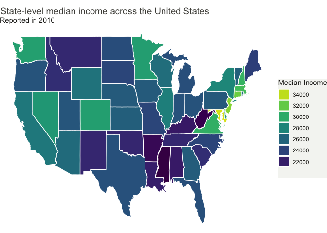

Choropleth map of presidential election results of 1980
================

## Choropleth map

We are going to use the `elect80` data set which contains the
Presidential election results of 1980 covering 3,107 US counties using
geographical coordinates. First of all, we are going to use the FIPS
codes to find the exact state and county. We are going to use the
`county.fips` function which is a database matching FIPS codes to maps
package county and state names.After matching our two dataframes we drop
the columns and keep the region and pc_turnout variables. To plot the
outlines of a geographical region, we use ggplot2::map_data(). This will
extract coordinate data from the maps library, to create a data frame
containing the boundaries of one of a selection of geographical regions.
Once we have the coordinates for the boundaries of our spatial regions,
we can match this to the values of our spatial variable of interest
using one of the ‘mutating joins’ from the dplyr library.

